# Privacy Act 1988: High-Precision RAG Advisory System

```mermaid
graph TD
    %% Define the Ingestion Flow
    subgraph Ingestion_Pipeline [Ingestion Pipeline]
        Docs[PDF Document] --> Chunking[Section-wise Chunking]
        Chunking --> Embed[Embedding Model]
        Embed --> VDB[(FAISS + BM25 Indices)]
    end

    %% Define the Retrieval Flow
    User([User Query]) --> Rewrite[Query Expansion / Rewriting]
    Rewrite --> Retrieval{Hybrid Search +<br/>Ensemble Retrieval}
    
    VDB <--> Retrieval
    
    Retrieval --> Rerank[Cross-Encoder Reranker]
    Rerank --> Context[Top-K Refined Context]
    
    %% Define the Generation Flow
    Context --> LLM[LLM Generator]
    LLM --> Out([Final Response + Citations])

    %% Professional Styling
    style VDB fill:#16161e,stroke:#333,stroke-width:2px
    style Retrieval fill:#24283b,stroke:#d4a017,stroke-width:2px
    style LLM fill:#24283b,stroke:#01579b,stroke-width:2px
```

An enterprise-grade Retrieval-Augmented Generation (RAG) system specialised in the **Australian Privacy Act 1988**. This utilises a **Two-stage retrieval** architecture (Bi-Encoder + Cross-Encoder) to provide cited, grounded, and legally-aligned advisory responses.

## 🎯 Engineering Philosophy

   Legal documents present a unique set of challenges for standard RAG pipelines: complex hierarchies, interdependent clauses, exceptions, exemptions, and a high risk of "hallucinated" response. This project addresses these challenges with the following tools and strategies:

* **Structural Integrity:** Legislation-aware chunking that preserves context.
* **Hybrid Search:** Merging semantic (FAISS) and keyword (BM25) search to capture both intent and specific citations. Ensemble retrieval technique is applied with a balanced weight attribution between dense and sparse indices after a couple of trials.  
* **Precision Funneling:** A Cross-Encoder reranking stage to filter out low-confidence context before LLM generation.

## 🛠 Technical Deep Dive
1. **Domain-Specific Ingestion (The Chunker):** Unlike naive character splitters, the
   DocumentChunker utilises a Hierarchical Regex Strategy to mirror the Act's structure:

   *Segmentation:* Distinguishes between the Main Act and Schedule 1 (Australian Privacy Principles) and other Schedules.

   *Unit Detection:* Locates sections, subsections, APPs, and clauses to ensure embeddings contain complete legal structures and semantics.

   *Metadata Injection:* Every chunk is enriched with its unit_id (section/ clause number) and unit_title (major divisions), enabling the BM25 retriever to provide citations accurately and appropriately.

2. **Two-Stage Hybrid Retrieval:** To solve the "Needle in a Haystack" problem, 
   the system employs a two-stage funnel:

   *Recall Stage (Hybrid Search):* Uses Reciprocal Rank Fusion (RRF) to combine dense vectors from FAISS with sparse keyword scores from BM25.

   *Precision Stage (Reranking):* Uses a Cross-Encoder (ms-marco-MiniLM) to perform a computationally expensive but highly accurate relevance check on the top candidates.

3. **Grounded Generation & Guardrails:** The LLM is governed by a Modular System Prompt
    using Markdown delimitation (###) for clear instruction-following. It implements a "Silence over Falsehood" policy:

   *Confidence Thresholding:* If the Reranker returns scores below a specific threshold, the pipeline triggers a "Safe Refusal" rather than guessing an answer.

   *Strict Grounding:* The model is prohibited from using internal knowledge, forcing it to cite the provided legal context.

## Evaluation Framework

This project incorporates the RAGAS framework to quantitatively evaluate the performance of the Retrieval-Augmented Generation (RAG) pipeline. Using a benchmark dataset derived from the Australian Privacy Act 1988, the evaluation process measures both response quality and retrieval effectiveness through automated LLM-based assessment.

The current evaluation suite includes:

* **Faithfulness** – Verifies that generated answers are grounded in the retrieved context.
* **Answer Relevancy** – Measures how effectively responses address the user's query.

Evaluation reports are generated automatically, enabling consistent benchmarking and comparison of retrieval strategies, prompt variations, and model configurations.


## 🚀 Deployment & AIOps
* **Optimized Resource Management:** Uses Streamlit's @st.cache_resource to manage memory-intensive models (Reranker and Vector Store) on CPU-bound environments.

* **Observability:** Integrated structured logging captures pipeline latency and retrieval scores for performance auditing.

* **Robust Exception Handling:** A custom exception module ensures the UI fails gracefully and provides actionable logs for developers.

## 🏗 Modular Architecture

   The codebase follows a modular design pattern, ensuring that the data ingestion, search indexing, and generation logic are decoupled and independently scalable.

```text
├── src/rag/
│   ├── chunker.py        # Legislation-aware PDF parser and hierarchical splitter
│   ├── hybrid_store.py   # Dual-index management (FAISS & BM25) with RRF
│   ├── rag_pipeline.py   # LCEL orchestration, reranking, and grounded generation
│   ├── exception.py      # Domain-specific custom error handling & hierarchy for AIOps
│   ├── config.py         # Centralised environment and model settings
│   └── logger.py         # Structured telemetry and pipeline logging
├── hybrid_store/
│   ├── bm25_store
│   │    └── bm25_retriever.pkl     # Sparse indices (for keyword search)
│   └── faiss_index
│        ├── index.faiss            # Dense indices (for semantic search)
│        └── index.pkl
│
│
├── evaluation/
│   ├──datasets
│   ├──experiments
│   ├──reports
│   └── eval_pipeline.py
├── streamlit_app.py      # Streamlit UI with Recall/ Precision depth controls
├── README.md             # Description of the project and AIOps steps followed
└── requirements.txt      # Project dependencies
```